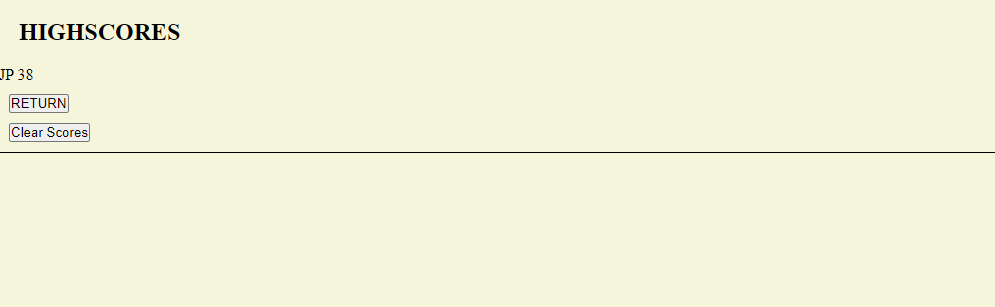

# WebDev-Quiz

## Description

Created a Quiz that stores your score and intials to localstorate and then saves them in the highscores. The application is to be used as a way to study and improve knownledge on basic programming principles as well as exhibit my own aptitude in quiz creation.

## Installation

N/A

## Usage

Clicking the start button begins the quiz presenting questions.  Correct answers add 5 seconds to the timer/score and wrong answers subtract 5 seconds. After answering all the questions or if the time runs out you are brought to an ending screen to save your score with your initials.  You are then sent back to the beginning screen of the quiz to try again.  From there you can either redo the quiz for another score or check the scores saved by clicking on the "Highscores" link.

Provide instructions and examples for use. Include screenshots as needed.

To add a screenshot, create an `assets/images` folder in your repository and upload your screenshot to it. Then, using the relative file path, add it to your README using the following syntax:

## Credits

https://www.youtube.com/watch?v=PBcqGxrr9g8

Used this video to help get a grasp on quiz design, specifically editing the HTML elements from the JS file.

## License

Refer to the repo
